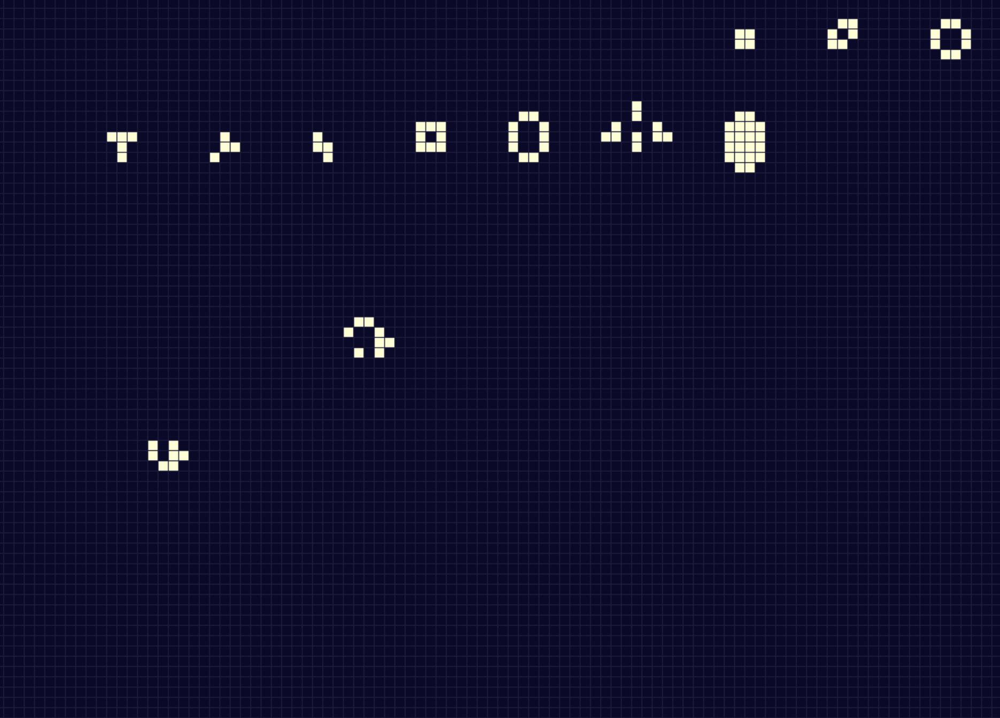

# More Layers Game Of Life

1. Thank you for wandering here at the more layers game of life!
2. In the file named 2layer_patterns.py you can find the main portion of the code.
3. You should see the 2layer_patterns.gif when you run!
4. There's a lot of fun to explore and good luck!

To run the program please run
```
python3 2layer_patterns.py
```
Currently the GUI is static and the cells are hardcoded in

## Example GIF



## Dependencies:

- PyGame
- Numpy
- Matplotlib

Dependencies can be installed by using `pip3 install <dependency>`

## License

This work uses the [MIT License](https://opensource.org/licenses/MIT). The full license can also be found at LICENSE.md
